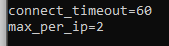
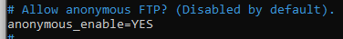
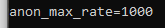
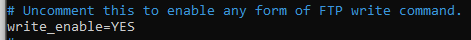
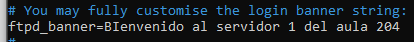

# Tarea semana 27

## Enunciado

Entrar como usuario administrador y modificar dicho archivo para que cumpla los siguientes requisitos:

 ·     60 segundos de inactividad

·     Permitir un máximo de 2 conexiones simultáneas

·     Permitir conexiones anónimas

·     Ofrecer un máximo de 1K por segundo de transferencia en conexiones anónimas

·     Sólo permitir lectura

·     Mensaje:

  Bienvenida: Bienvenido al servidor XX del Aula 204

·     Copiar varios archivos al este directorio /srv/ftp para comprobar que son accesibles vía FTP. Esta carpeta es la carpeta por utilizada para conexiones anónimas.

## Puntos

En primer lugar, editamos el archivo de configuración de vsftpd que se encuentra en la siguiente ruta, `/etc/vsftpd.conf`

Los parámetros que debemos modificar son los siguientes.

Usuarios anónimos:

Máximo de transferencia:

Sólo permitir lectura:

Mensaje:

