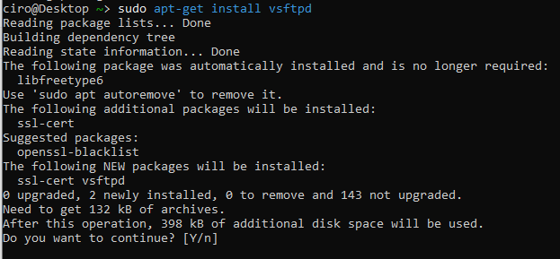
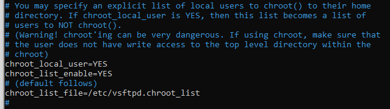
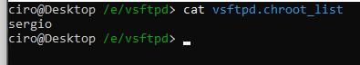
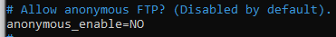
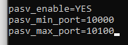
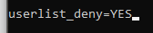
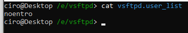
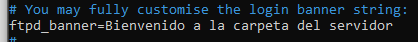

# Tarea VSFTP

Deseamos configurar un servidor VSFTP, este servidor deberá permitir acceso seguro mediante el protocolo sftp y creando certificado. Este servidor debe habilitar el modo pasivo como se indica en el enunciado. El servidor deberá cumplir las siguientes normas:

1. Los usuarios que se conecten al ftp no podrán salir de sus directorios, o sea no podrán subir por el árbol de directorios. Salvo El usuario principal con el que ejecutas comandos de superusuario si podrá subir por el árbol de directorio. Ej. Usuario Sergio

2. No deberán estar permitidos los accesos anónimos.

3. Activa el modo pasivo. Habilita los puertos de uso desde 10000 al 10100. Sucesivamente.

4. Crea un usuario llamado “no entro” y no permitas que dicho usuario pueda entrar en el servidor

5. En el momento que el usuario entre al servidor FTP en modo comando debe mostrarse un mensaje indicando: “Bienvenido a la carpeta del servidor”.


## Ejercicio

En primer lugar, instalo VSTPD mediante este comando:


```bash
sudo apt-get install vsftpd
```




## Punto 1

Para enjaular a los usuarios en sus respectivos directorios, edito el archivo de configuración de vsftpd.

Dicho archivo se encuentra en el directorio `/etc/vsftpd.conf`

Descomento las siguientes directivas:



Ahora, dentro del archivo chroot_list, permitimos que el usuario administrador Sergio no se encuentre enjaulado.

 


## Punto 2

Para evitar que usuarios anónimos accedan al servidor, vuelvo a editar el archivo de configuración.

En este caso, el valor por defecto es que NO se puedan conectar, de forma que mantengo el valor por defecto.




## Punto 3

Para activar el modo pasivo en los puertos indicados, habilito estos parámetros en la configuración:




## Punto 4

En primer lugar, habilito la directiva de configuración para prohibir el acceso de ciertos usuarios.



Ahora, igual que en el punto 1, genero el archivo donde se van a especificar los usuarios sin acceso.




## Punto 5

Para habilitar el banner, aplico esta directiva.

